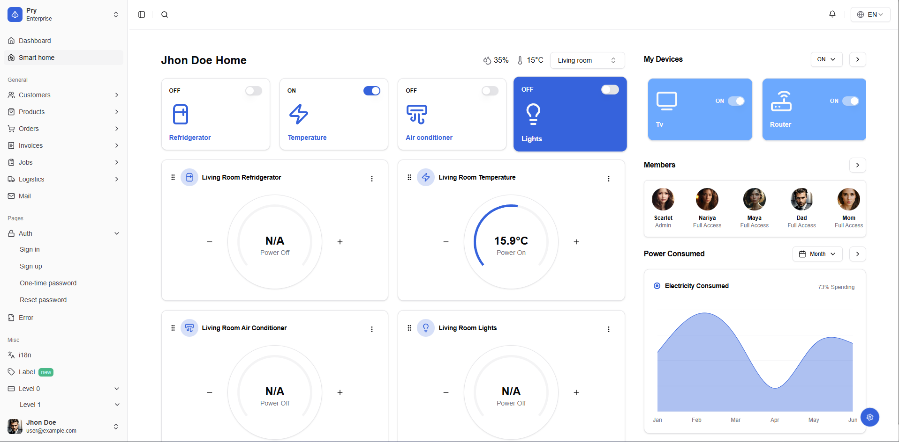

## [Pry](https://pry-nextjs-pro.vercel.app/)

Pry is a complete, scalable, and customizable solution for building a SaaS application built to get you started on the right foot.

This Next.js version uses the new App Router introduced with Next.js 15, which is built on top of the new React Server Components.

### [Documentation](https://pry-docs.vercel.app/)

### Reporting Issues:

- [Github Issues Page](https://github.com/fiqryx/prykit-nextjs-pro/issues)

### License

- Licensed under [MIT](https://github.com/fiqryx/prykit-nextjs-pro/blob/main/LICENSE)